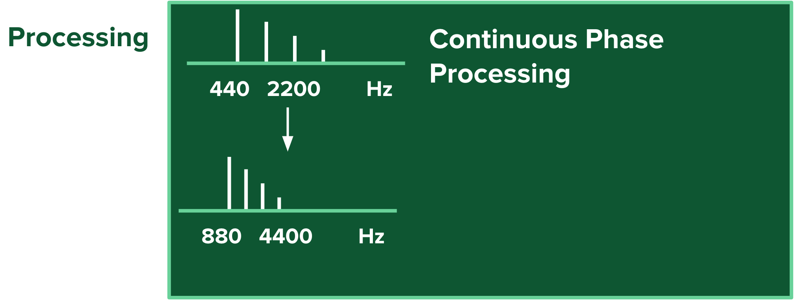

# Phase-Vocoder
  repo link 
  https://github.com/davispolito/Phase-Vocoder.git

## Project Motivation
   Phase Vocoding forms the basis of complex tools such as Autotune and the Prizmizer as well as Time stretching useful in quantization. These effects are commonly loaded offline, not allowing for real time manipulation or performance (Paul Stretch) or require computers to run the software (Autotune, the Messina, etc.). By utilizing a GPU to parallelize the fft and frequency domain operations, this project aims to put the power of Phase Vocoding into the hands of all musicians. 
   
## The algorithm
  At the core of Phase Vocoding is the Fast Fourier Transform, a complex mathematical tool separating time domain signals into their discrete frequency components.
  Taking individual fourier transforms of samples that take into account parts of the frame before them, we are able to create a Short Time Fourier Transform Analysis 
  that allows us to view and manipulate not only the instantaneous phase but also the phase difference, representing the varying frequency components of a signal. 
  After completing the analysis, time stretching and pitch shifting can be applied to the frequency content through operations as simple as vector scaling. 
  These new vectors are then resynthesized using an Inverse Fourier Transform or Additive Synthesis. I hope to explore both options to determine which will work best in real time.

 Graphically the algorithm can be described as follows

During the analysis phase we first take the input wave form and window it using a windowing function such as hanning or hamming. The purpose of the windowing function is to spread power and phase information across multiple "snapshots" of the audio wave form. The next phase is to time alias and zero pad the input. Zero padding increases the accuracy of the next step which is the Fourier Transform. The Fourier Transform transforms the time domain signal into polar coordinates which can then be changed into magnitude and phase information. 

The Processing that occurs here depends on the effect. Time shifting would feature modification of the hop/overlap size as well as scaling of phase information over time. 
In the case of pitch modification careful measure must be taken to determine the continuous phase or phase difference between windows.

Resynthesis is simply the inverse fourier transform as well as proper scaling (by window size) and time shifting of the signal

## Current State of the system
When given an input wav at 440 Hz as show by this spectrum diagram

The current code outputs this when shifted

As you can see there is a bug that is not maintaining the frequency information properly

On closer inspection it appears that their is a changing amplitude issue. I have yet to determine the cause of the bug
I have built a system into the code to test the overlap adding characteristics and believe that their may be an issue with windowing and shifting.

## Developing the Algorithm for Real Time Audio Processing
I am currently in the process of developing the Real Time version of this algorithm. Unfortunately do to bugs in the initial algorithm I was unable to finish it on time.

In order to run this process in real time we must first use a thread based callback system on the CPU. Whenever the audio buffer is full we will then spawn `Number of Samples / Hop Size` streams on the gpu to process the input signal. The algorithm will look backwards at the previous input as well utilizing a ring buffer to maintain continuity and conserve space. 

Using Streams rather than large kernels will allow the code to be increasingly modular and eventually support parallel processing of multiple inputs as well as harmonization of input signals (i.e. multiple pitch shifts on a single input) 

## The Jetson Nano
An important part of this project is the Nvidia Jetson Nano. The unified memory on the Jetson Nano avoids costly memory copy operations from cpu to GPU and makes this algorith viable to be used on embedded platforms in real time for the first time. 

## Analysis 

Above is the graph of the time required for the  analysis and resynthesis stage of a 10 second wav input. 

Above is the graph of the average time required for the analysis and resynthesis kernels. 

This analysis shows that these kernels are usable for Real time audio processing since they are well under the time that one window represents. In other words since 256 samples at a sampling rate of 44.1kHz represents 5.8 ms of audio and the algorith runs in less than 2ms

## Audio Samples
Unfortunately markdown does not support embedding audio. There is an audio sample in the output folder labeled 1000sinewaveout and will be an entire output folder tomorrow morning when I am back at the Jetson. (unfortunately Whenever i thought I was saving multiple files the names were not changing) 

## Branch System
#### cufft
  Tests of Cufft vs. GPU Cuda Algorithms developed from http://citeseerx.ist.psu.edu/viewdoc/download?doi=10.1.1.566.425&rep=rep1&type=pdf as well as one from a naive parallelization of Cooley-Tukey
   From the data obtained it was determined that Cufft was the fastest option available

   Since GPU RAM and CPU RAM are separate on computer systems it is important to take into account the time of memory copies. These computations are unimportant when running on the Jetson Nano, because it features a unified memory system. Memory copy operations took over 0.4ms on the computer GPU. CUFFT took 0.3ms on the Jetson Nano
#### nano-rt
   Here lies the code for realtime operation of the Phase Vocoding Algorithm on Jetson Nano.
   Current road block is this error
   `RtApiAlsa::getDeviceInfo: snd_pcm_open error for device (hw:1,0), Device or resource busy`
#### laptop-rt
   Forked from nano-rt this branch is being used to continue developing the real time algorithm for phase vocoding since nano-rt is facing issues with the linux/rasberry pi system. 
#### nano
   Used to compare the runtime of fft algorithms on the Jetson Nano vs. the Computer
  
